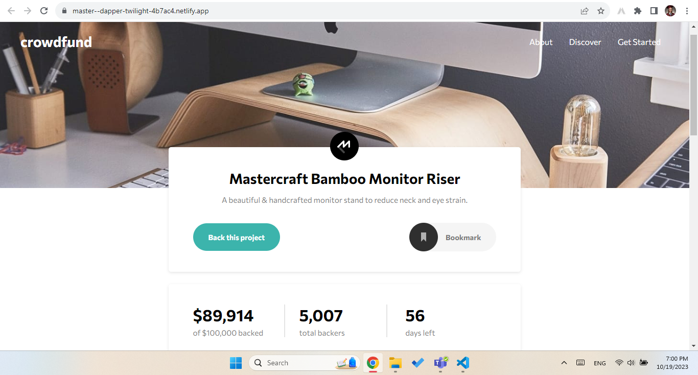

# Project Name

> One paragraph statement about the project.

Users should be able to:

- View the optimal layout depending on their device's screen size
- See hover states for interactive elements
- Make a selection of which pledge to make
- See an updated progress bar and total money raised based on their pledge total after confirming a pledge
- See the number of total backers increment by one after confirming a pledge
- Toggle whether or not the product is bookmarked

## Built With

- Semantic HTML5 markup
- CSS custom properties
- Responsive design
- Vanilla JavaScript

## Live Demo

[Live Demo Link](https://master--dapper-twilight-4b7ac4.netlify.app/)

## Authors

👤 **Author1**

- GitHub: [@ilievatijana](https://github.com/ilievatijana)
- LinkedIn: [Tijana Ilieva](linkedin.com/in/tijana-ilieva-412409248)

👤 **Author2**

- GitHub: [@jocka13](https://github.com/Jocka13)
- LinkedIn: [Jordan Velkovski](linkedin.com/in/jordanvelkovski)

## 🤝 Contributing

Contributions, issues, and feature requests are welcome!

Feel free to check the [issues page](issues/).

## Show your support

Give a ⭐️ if you like this project!

## Acknowledgments

- https://www.frontendmentor.io/
- Hat tip to anyone whose code was used
- Inspiration
- etc

## 📝 License

This project is [MIT](lic.url) licensed.